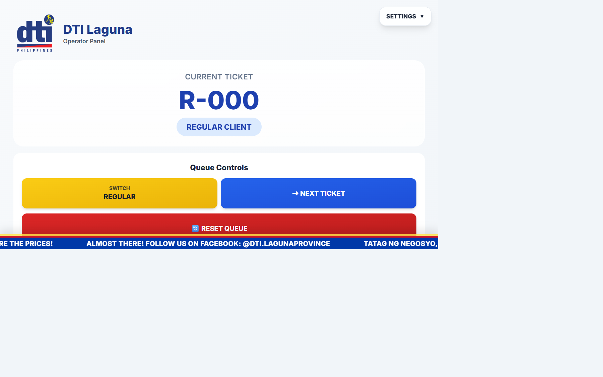
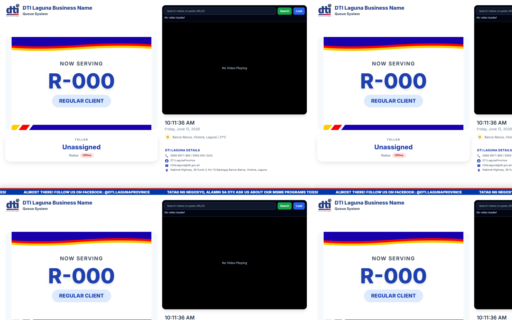

# DTI Laguna Queue Management System

[](https://www.python.org/)
[](https://www.microsoft.com/windows)
[](https://github.com/python-eel/Eel)

DTI Laguna Queue Management System is a Windows-based dual-display queue solution for service counters. It keeps the operator tools and the customer display separate so staff can manage tickets, monitor queue flow, and trigger announcements while customers see the current ticket, queue status, time, weather, and contact details in real time.

## Highlights

- Dual-display workflow for teller and customer screens
- Regular and Priority queue support
- Voice announcements and live status updates
- Weather, time, and public contact details on the client display
- Windows-friendly launcher and packaging scripts

## Screenshot

| Operator Panel | Client Display |
| --- | --- |
|  |  |

The screenshots above show the actual operator and customer interfaces generated from the app UI.

## Quick Summary

This project provides a practical queue-management interface for service counters that need a simple operator panel and a clean public display. It is designed for Windows and can run as a paired local app or be packaged for desktop deployment.

## Overview

The system runs two connected windows:

- Operator Panel: the staff control panel for queue actions, statistics, and settings
- Client Display: the customer-facing screen that shows the current ticket and live queue status

The two windows communicate locally over HTTP so changes in the operator panel update the client display immediately.

## Features

### Operator Panel

- Switch between Regular and Priority queue modes
- Call the next customer with automatic voice announcements
- Track served counts and waiting customers
- Add and manage customers in the waiting queue
- Display YouTube videos for waiting-room entertainment
- Reset the queue when needed
- Adjust teller name, gender, theme, volume, and audio settings

### Client Display

- Large ticket number display for easy visibility
- Status indicator for Regular or Priority service
- Waiting queue progress display
- Live time and date
- Weather information for Laguna
- DTI contact details for the public display

## Requirements

- Windows 10 or Windows 11
- Python 3.x
- Google Chrome or another Chromium-based browser
- Internet connection for weather data and YouTube playback

The app uses Windows-specific features such as `winsound`, so it is intended for Windows systems only.

## Installation

### 1. Clone the repository

```bash
git clone https://github.com/aer-cal/DTI-Laguna-Business-Name-Queuing-System.git
cd DTI-Laguna-Business-Name-Queuing-System
```

### 2. Create and activate a virtual environment

```bash
python -m venv .venv
.venv\Scripts\activate
```

### 3. Install dependencies

```bash
pip install eel pyttsx3 requests
```

If you plan to package the app into a Windows executable, also install PyInstaller:

```bash
pip install pyinstaller
```

## Usage

### Option 1: Run the launcher

Double-click `run.bat` to start the system with both windows.

### Option 2: Start the operator panel

```bash
python queue_system.py
```

This opens the Operator Panel on port 8000 and starts the Client Display on port 8001.

### Option 3: Start the client display

```bash
python client_display.py
```

This opens the Client Display on port 8001 and starts the Operator Panel on port 8000.

### Local ports used by the app

- 8000: Operator Panel
- 8001: Client Display
- 8002: Client update server
- 8003: Operator shutdown server

## Project Structure

- `queue_system.py` - Operator panel backend and UI launcher
- `client_display.py` - Customer-facing display backend and UI launcher
- `web/` - HTML, CSS, images, and frontend assets
- `run.bat` - Windows launcher for both windows
- `build_windows_app.ps1` / `build_windows_app.bat` - Packaging scripts
- `install_desktop_shortcut.bat` - Shortcut installer

## Building for Windows

If you want to package the system as a desktop application, use the provided build scripts:

```bash
build_windows_app.ps1
```

or

```bash
build_windows_app.bat
```

These scripts are intended for creating a distributable Windows build and desktop shortcut.

## Troubleshooting

### Both windows do not open

- Make sure ports 8000, 8001, 8002, and 8003 are not already in use
- Try running `queue_system.py` and `client_display.py` separately in two terminals
- Check whether a firewall or antivirus tool is blocking local connections

### YouTube video does not load

- Check that the computer has internet access
- Try using the YouTube video ID instead of the full URL
- Make sure the video is publicly accessible

### No sound or announcement audio

- Check the system volume on the operator computer
- Confirm that speakers are connected and selected as the output device
- Verify that Windows audio is working outside the app

### Port already in use

- Close other apps that may be using the same port
- Restart the app after freeing the port
- Update the port values in the Python files if needed

### Desktop shortcut missing

- Run `install_desktop_shortcut.bat` again as the current Windows user
- Make sure the project folder is not blocked by permissions or sync issues

## Customization

You can adjust the appearance and behavior by editing:

- `web/index.html` for the operator interface
- `web/client.html` for the client display
- `web/styles.css` for shared styling
- `queue_system.py` for operator behavior and settings
- `client_display.py` for display behavior and update handling

## Credits

- Built with Python and Eel
- Frontend styling uses HTML and Tailwind CSS
- Text-to-speech announcements use `pyttsx3`
- This project was created for the DTI Laguna queue management workflow

## License

Add a license here if you want the project to be public on GitHub.